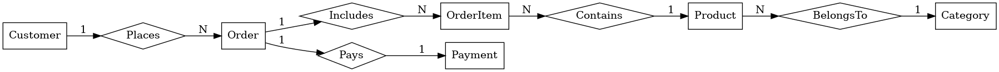

# 🛒 RetailDB SQL Practice Project

This repository contains a fully structured PostgreSQL dataset designed for hands-on practice with SQL concepts such as **joins**, **subqueries (correlated & uncorrelated)**, **aggregations**, and **filtering**. It includes a `RetailDB` schema simulating a simple e-commerce business with customers, orders, products, categories, and payments.

## 📁 Contents

- `retaildb_schema.sql` – SQL script to create and populate the database
- `retaildb_queries.sql` – A set of 17 SQL queries demonstrating advanced SQL techniques
- `retaildb_chen_erd_cardinality.png` – Entity-Relationship Diagram (Chen's Notation with cardinality)
- `README.md` – Project overview and instructions
---

## 🧱 Database Schema

The project includes 6 core tables:

- `customers` – Customer profiles and signup dates
- `categories` – Product categories
- `products` – Products with pricing and category info
- `orders` – Customer orders with status
- `order_items` – Line items in each order
- `payments` – Payment details for orders

## 🧩 Entity-Relationship Diagram (ERD)

The following ERD (Chen's Notation with cardinality) illustrates how the tables in the RetailDB schema are related:

### 📝 Diagram Notes:
- A **Customer** can place **many Orders**
- An **Order** can include **many Order Items**
- Each **Order Item** refers to **one Product**
- A **Product** belongs to **one Category**
- Each **Order** is associated with **one Payment**

This visualization helps understand the relationships and cardinalities between entities, which is especially useful when working with joins and subqueries.

## ✅ SQL Challenges Covered

| #   | Description                                                                 |
|-----|-----------------------------------------------------------------------------|
| 1️⃣  | Orders with total amount > average order total                             |
| 2️⃣  | Order items priced above product’s average price                           |
| 3️⃣  | Customers with more than one order                                          |
| 4️⃣  | Products priced above average                                               |
| 5️⃣  | Most expensive order per customer                                           |
| 6️⃣  | Active products never ordered                                               |
| 7️⃣  | Customers with paid orders in April 2024                                    |
| 8️⃣  | Orders including “Accessories” category products                            |
| 9️⃣  | Best-selling product per category                                           |
| 🔟  | Category with the highest total revenue                                     |
| 1️⃣1️⃣ | Customers with AOV > global AOV                                             |
| 1️⃣2️⃣ | Customers with orders but no paid/shipped ones                             |
| 1️⃣3️⃣ | Orders where paid amount < item total                                       |
| 1️⃣4️⃣ | Top 3 cities by total revenue                                               |
| 1️⃣5️⃣ | Orders with quantity > average for product                                  |
| 1️⃣6️⃣ | Customers who signed up before 2024-03-01 and ordered after                 |
| 1️⃣7️⃣ | Orders matching the highest order total                                     |

